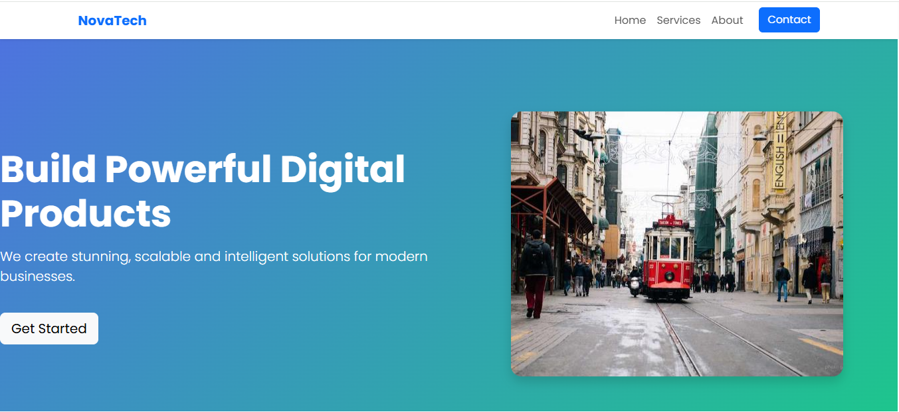

NovaTech – Modern Responsive Website (Bootstrap)

NovaTech is a modern, responsive, and visually engaging website built using HTML, CSS, JavaScript, and Bootstrap 5. It demonstrates practical use of Bootstrap layout systems including containers, grid classes, and responsive components to create a professional business landing page.

🚀 Project Overview

This project represents a digital agency-style website designed to showcase services, company information, and call-to-action sections. The layout is fully responsive and optimized for different screen sizes.

🛠️ Technologies Used

HTML5

CSS3

JavaScript

Bootstrap 5

Google Fonts (Poppins)

📌 Key Features

Responsive navigation bar with collapse menu

Hero section with gradient background and animation

Bootstrap Grid System implementation

Service cards with hover effects

About section with image and content layout

Call-to-action (CTA) section

Footer with branding

Smooth scrolling and clean UI design

📂 Bootstrap Concepts Implemented

container, container-fluid, container-xxl

Responsive grid (col-12, col-md-6, col-lg-4)

Navbar component

Buttons, shadows, spacing utilities

Responsive image handling

🎯 Purpose of the Project

This project was created to practice:

Frontend layout design

Bootstrap responsive system

Modern UI/UX structure for business websites

Clean and maintainable front-end code

📸 Screens Included

Home / Hero section

Services section

About section

CTA and Footer

▶️ How to Run the Project

Download or clone the repository

Open the project folder

Run the index.html file in any browser

📈 Future Improvements

Add contact form with backend integration

Include animations using libraries (AOS / GSAP)

Improve accessibility and SEO

Add portfolio and testimonials section

👨‍💻 Author

Developed as a frontend practice project to demonstrate Bootstrap layout and responsive design skills.
